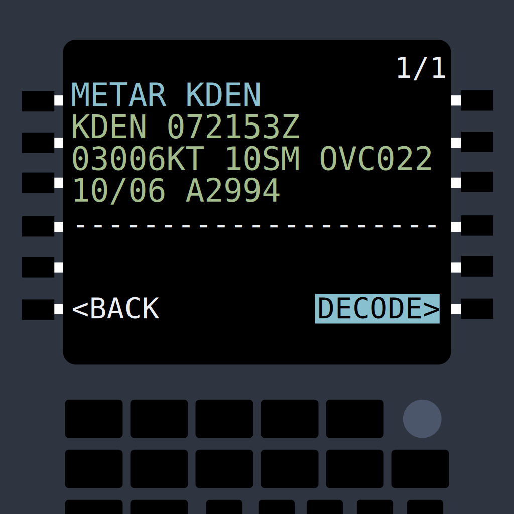

# WxCraft


[](https://github.com/rmitchellscott/WxCraft/releases)
[](https://github.com/rmitchellscott/WxCraft/actions/workflows/build.yaml)

A command-line tool for fetching, decoding, and displaying: 
- Aviation weather reports (METAR)
- Forecasts (TAF)

## Disclaimer
This tool is provided for educational and informational purposes only. It should NOT be used for actual flight preparations, flight planning, or any aviation operations. 

## Overview

This Go application provides aviation enthusiasts and weather watchers with human-readable interpretations of aviation weather data. It automatically fetches the latest METAR (Meteorological Aerodrome Report) and TAF (Terminal Aerodrome Forecast) for any airport with an ICAO code and presents the information in an easy-to-understand format.

## Features

- Fetch real-time METAR and TAF data from aviationweather.gov
- Decode cryptic aviation weather codes into plain English
- Display weather data in a clean, organized format
- Support for all standard aviation weather elements:
  - Wind direction, speed, and gusts
  - Visibility
  - Present weather conditions (rain, snow, thunderstorms, etc.)
  - Cloud coverage and heights
  - Temperature and dew point (in both Celsius and Fahrenheit)
  - Barometric pressure (in both inHg and millibars)
  - Detailed interpretation of remarks
- Geolocates nearest airport by IP address

## Installation

### Homebrew (macOS)
`brew install rmitchellscott/tap/wxcraft`

### Download Prebuilt Binaries

1. Visit the [releases page](https://github.com/rmitchellscott/WxCraft/releases)
2. Download the appropriate version for your operating system:
   - Windows: `wxcraft_windows_amd64.zip`
   - macOS: `wxcraft_darwin_amd64.tar.gz` (Intel) or `wxcraft_darwin_arm64.tar.gz` (Apple Silicon)
   - Linux: `wxcraft_linux_amd64.tar.gz`
3. Extract the downloaded archive
4. Move the executable to a location in your PATH (optional)

### Building from Source

If you prefer to build from source:

```bash
git clone https://github.com/rmitchellscott/WxCraft.git
cd WxCraft
go build
```

## Usage

```bash
# Basic usage - will prompt for an airport code
wxcraft

# Specify an airport code
wxcraft KJFK

# Specify a US ZIP code
wxcraft 90210

# Show the METAR for the nearest airport by IP location
wxcraft -nearest

# Show only METAR data
wxcraft -metar KLAX

# Show only TAF (forecast) data
wxcraft -taf KBOS

# Hide raw data
wxcraft -no-raw EGLL

# Show only raw data
wxcraft -no-decode KDEN

# Process raw METAR from stdin
echo "KBOS 110054Z 12015G27KT 3SM -RA BR OVC007 08/07 A2978" | wxcraft

# Process raw TAF from stdin
echo "TAF KBOS 110547Z 1106/1212 14012KT 4SM -RA BR OVC008" | wxcraft

# Force METAR interpretation regardless of auto-detection
echo "TAF KBOS 110547Z 1106/1212 14012KT 4SM -RA BR OVC008" | wxcraft -metar

# Force TAF interpretation regardless of auto-detection
echo "KBOS 110054Z 12015G27KT 3SM -RA BR OVC007 08/07 A2978" | wxcraft -taf

# Process data in offline mode (no API calls)
echo "KJFK 110154Z 09007KT 10SM FEW040 BKN250 12/01 A3013 RMK AO2" | wxcraft -offline

# Force TAF interpretation in offline mode
echo "KBOS 110054Z 12015G27KT 3SM -RA BR OVC007 08/07 A2978" | wxcraft -offline -taf
```

### Example Output

```
Fetching METAR for KSFO...

Raw METAR:
KSFO 080556Z 29011KT 10SM CLR 10/08 A3022 RMK AO2 SLP232 T01000078 10144 20100 53013

Decoded METAR:
Station: KSFO (San Francisco Intl, CA, US)
Time: 2025-03-08 05:56 UTC (42 minutes ago)
Wind: From 290° at 11 knots
Visibility: 10 statute miles
Weather: Clear
Temperature: 10°C | 50°F
Dew Point: 8°C | 46°F
Pressure: 30.22 inHg | 1023.4 mbar

Remarks:
  AO2: Automated station with precipitation sensor
  SLP232: Sea level pressure 1023.2 hPa
  T01000078: Temperature 10.0°C, dew point 7.8°C
  10144: 6-hour maximum temperature 14.4°C
  20100: 6-hour minimum temperature 10.0°C
  53013: Pressure tendency: increasing, then increasing more rapidly, 1.3 hPa change
```

## Command-Line Options

- `-metar`: Show only METAR data
- `-taf`: Show only TAF data
- `-nearest`: Select the closest ICAO station by geolocating IP address
- `-radius 100`: Set the search radius for nearest airport (default: 50 miles)
- `-no-raw`: Hide the raw METAR/TAF data
- `-no-decode`: Show only raw METAR/TAF data
- `-no-color`: Disable color in the output
- `-offline`: Operate in offline mode (only works with stdin data)

## Input Methods

The application accepts input in several ways:

1. **Command-line argument**: Pass the ICAO code as a command-line argument
2. **Interactive prompt**: If no argument is provided, you'll be prompted to enter an ICAO code
3. **Piped input**: You can pipe raw METAR or TAF data directly into the application
   - The application automatically detects whether the input is METAR or TAF
   - You can override auto-detection by using the `-metar` or `-taf` flags
   - Use the `-offline` flag to process data without making any API calls (useful for environments without internet access)
   - In offline mode, station information is retrieved from an embedded database within the binary

## Weather Phenomena Decoded

The application decodes a comprehensive range of weather phenomena, including:

- Different precipitation types (rain, snow, drizzle, etc.)
- Intensity modifiers (light, heavy)
- Thunderstorms and associated conditions
- Visibility restrictions (fog, mist, haze, etc.)
- Special conditions (freezing precipitation, blowing snow, etc.)

## Cloud Coverage Terminology

| Code | Description |
|------|-------------|
| SKC/CLR | Clear skies |
| FEW | Few clouds (1/8 to 2/8 coverage) |
| SCT | Scattered clouds (3/8 to 4/8 coverage) |
| BKN | Broken clouds (5/8 to 7/8 coverage) |
| OVC | Overcast (8/8 coverage) |

## License

This project is licensed under the MIT License - see the LICENSE file for details.

## Acknowledgments

- Data provided by the [Aviation Weather Center](https://aviationweather.gov/)
- Based on standard METAR and TAF formats defined by the World Meteorological Organization and ICAO
