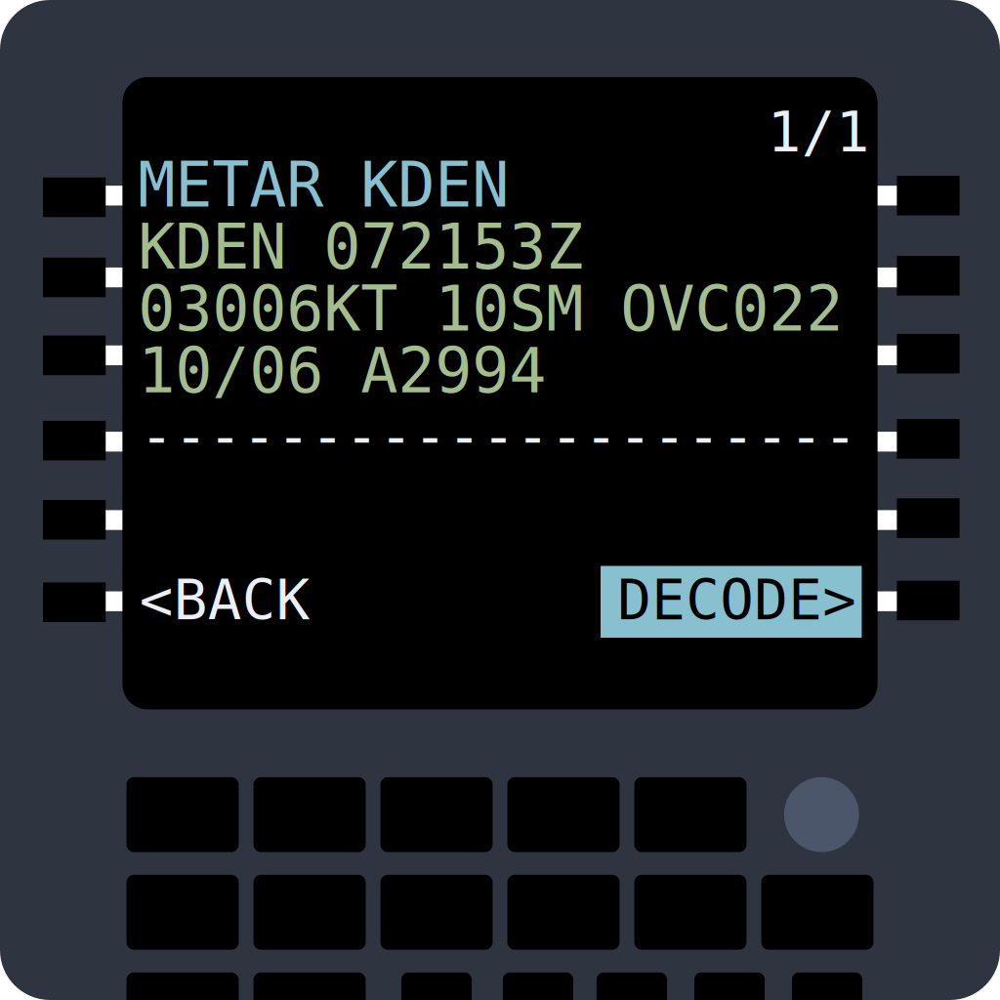

# WxCraft


A command-line tool for fetching, decoding, and displaying aviation weather reports (METAR) and forecasts (TAF).

## Disclaimer
This tool is provided for educational and informational purposes only. It should NOT be used for actual flight preparations, flight planning, or any aviation operations. 

## Overview

This Go application provides pilots, aviation enthusiasts, and weather watchers with human-readable interpretations of aviation weather data. It automatically fetches the latest METAR (Meteorological Aerodrome Report) and TAF (Terminal Aerodrome Forecast) for any airport with an ICAO code and presents the information in an easy-to-understand format.

## Features

- Fetch real-time METAR and TAF data from aviationweather.gov
- Decode cryptic aviation weather codes into plain English
- Display weather data in a clean, organized format
- Support for all standard aviation weather elements:
  - Wind direction, speed, and gusts
  - Visibility
  - Present weather conditions (rain, snow, thunderstorms, etc.)
  - Cloud coverage and heights
  - Temperature and dew point (in both Celsius and Fahrenheit)
  - Barometric pressure (in both inHg and millibars)
  - Detailed interpretation of remarks

## Installation

### Homebrew (macOS)
`brew install rmitchellscott/tap/wxcraft`

### Download Prebuilt Binaries

1. Visit the [releases page](https://github.com/rmitchellscott/WxCraft/releases)
2. Download the appropriate version for your operating system:
   - Windows: `wxcraft_windows_amd64.zip`
   - macOS: `wxcraft_darwin_amd64.tar.gz` (Intel) or `wxcraft_darwin_arm64.tar.gz` (Apple Silicon)
   - Linux: `wxcraft_linux_amd64.tar.gz`
3. Extract the downloaded archive
4. Move the executable to a location in your PATH (optional)

### Building from Source

If you prefer to build from source:

```bash
git clone https://github.com/rmitchellscott/WxCraft.git
cd WxCraft
go build
```

## Usage

```bash
# Basic usage - will prompt for an airport code
wxcraft

# Specify an airport code
wxcraft KJFK

# Show only METAR data
wxcraft -metar KLAX

# Show only TAF (forecast) data
wxcraft -taf KBOS

# Hide raw data
wxcraft -no-raw EGLL
```

### Example Output

```
Fetching METAR for KSFO...

Raw METAR:
KSFO 071756Z 28015G25KT 10SM FEW008 BKN200 16/10 A2999 RMK AO2 SLP156 T01560100

Decoded METAR:
Station: KSFO
Time: 2025-03-07 17:56 UTC (2 hours ago)
Wind: From 280° at 15 knots, gusting to 25 knots
Visibility: 10 statute miles
Clouds: Few clouds at 800 feet, Broken clouds at 20,000 feet
Temperature: 16°C | 60°F
Dew Point: 10°C | 50°F
Pressure: 29.99 inHg | 1016.2 mbar

Remarks:
  AO2: Automated station with precipitation sensor
  SLP156: Sea level pressure 1015.6 hPa
  T01560100: Temperature 15.6°C, dew point 10.0°C
```

## Command-Line Options

- `-metar`: Show only METAR data
- `-taf`: Show only TAF data
- `-no-raw`: Hide the raw METAR/TAF data

## Input Methods

The application accepts input in several ways:

1. **Command-line argument**: Pass the ICAO code as a command-line argument
2. **Interactive prompt**: If no argument is provided, you'll be prompted to enter an ICAO code
3. **Piped input**: You can pipe raw METAR data directly into the application

## Weather Phenomena Decoded

The application decodes a comprehensive range of weather phenomena, including:

- Different precipitation types (rain, snow, drizzle, etc.)
- Intensity modifiers (light, heavy)
- Thunderstorms and associated conditions
- Visibility restrictions (fog, mist, haze, etc.)
- Special conditions (freezing precipitation, blowing snow, etc.)

## Cloud Coverage Terminology

| Code | Description |
|------|-------------|
| SKC/CLR | Clear skies |
| FEW | Few clouds (1/8 to 2/8 coverage) |
| SCT | Scattered clouds (3/8 to 4/8 coverage) |
| BKN | Broken clouds (5/8 to 7/8 coverage) |
| OVC | Overcast (8/8 coverage) |

## License

This project is licensed under the MIT License - see the LICENSE file for details.

## Acknowledgments

- Data provided by the [Aviation Weather Center](https://aviationweather.gov/)
- Based on standard METAR and TAF formats defined by the World Meteorological Organization and ICAO
